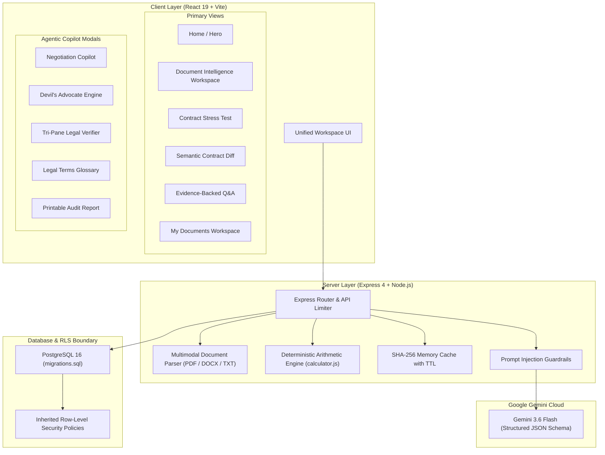

# ⚖️ LegalLens AI — Legal Document Intelligence Platform

> **Understand. Compare. Question. Act.**  
> *"See what you're signing. Understand what it means."*

[](https://hack2skill.com)
[](https://deepmind.google/technologies/gemini/)
[]()
[]()

LegalLens AI is a **production-grade, multimodal legal document intelligence operating system** engineered for ordinary citizens, tenants, employees, and freelancers. It transforms opaque, heavily one-sided agreements into structured, plain-language insights, simulates real-world "what-if" scenarios, identifies hidden financial exposures with deterministic calculations, maps semantic clause relationships, and equips signers with redline negotiation counter-proposals.

---

## 🎯 Hackathon Problem Statement

**Hack2Skill:** *"AI for Legal Assistance & Access: Engineer GenAI solutions to simplify complex legal docs, compare contracts, or clarify clauses."*

### Why Most Legal AI Projects Fail:
1. **The PDF Summarizer Trap:** Generic summaries gloss over asymmetric forfeiture clauses, unilateral entry rights, and compounded late fees.
2. **Arithmetic Hallucination:** LLMs frequently miscalculate multi-year cumulative rents, misstate refundable deposits vs conditional penalties, or project inaccurate late fees.
3. **Hallucination Risk:** Fabricating statutory citations, notice periods, or non-existent clauses can lead users into serious legal jeopardy.
4. **Visual Placeholders:** Tools show flashy UI badges with mock metrics instead of real, grounded backend AI logic.

### How LegalLens AI Solves It:
- **Strict Separation of Concerns:** Deterministic code handles all arithmetic, dates, and financial aggregations; **Gemini 3.6 Flash** handles document understanding, semantic classification, scenario simulation, and counter-proposal generation.
- **The 4 Pillars of Grounding:** Every AI conclusion explicitly answers **WHAT**, **WHY**, **WHERE** (verbatim text citations), and **WHAT NEXT** (concrete action).
- **Tri-Pane Legal Context:** Strictly differentiates **DOCUMENT FACT** vs **EXTERNAL STATUTE / BENCHMARK** vs **AI INTERPRETATION**.
- **Anti-Hallucination & Fail-Closed Security:** Out-of-document queries are strictly refused (`found_in_document: false`). Isolated Demo Mode prevents leakage.

---

## 🏗️ Architecture & Security Engineering



### Key Architectural Safeguards:
1. **Inherited Row-Level Security (RLS):** Child entities (`clauses`, `document_versions`, `stress_tests`, `negotiations`) enforce ownership inheritance from parent `documents` using SQL `EXISTS` subqueries:
   ```sql
   CREATE POLICY clauses_select_policy ON clauses
   FOR SELECT USING (
     EXISTS (SELECT 1 FROM documents WHERE documents.id = clauses.document_id AND documents.user_id = auth.uid())
   );
   ```
2. **Deterministic Arithmetic:** Rents, deposits, per-diem late fees, and departure penalties are computed via deterministic math in `server/src/utils/calculator.js`, completely preventing LLM calculation hallucinations.
3. **Dual-Layer Anti-Injection:** Untrusted document text is insulated from instructions; systemic prompt injections (`IGNORE PREVIOUS INSTRUCTIONS`) are treated purely as inert text.

---

## ⚡ Critical GenAI & Document Intelligence Features

| # | Feature | Capability Description | Backend Service |
|---|---|---|---|
| 1 | **Contract Stress Test** | Simulates real-world emergencies (e.g. Job transfer in 3 months, 15-day late rent) to map contractual consequences. | `/api/stress-test` (Gemini 3.6 Flash) |
| 2 | **Free-Form What-If Simulator** | Allows arbitrary custom hypothetical inquiries with procedural step sequencing. | `/api/stress-test` |
| 3 | **Red Flag Hunter** | Deep-scan for asymmetric liabilities, unilateral landlord rights, and punitive forfeitures. | `/api/analyze` |
| 4 | **Contract X-Ray** | Visualizes contract risk spectrum (High vs Medium vs Standard) across all clauses. | Interactive Client + Analyzer |
| 5 | **Clause Relationship Graph** | Maps semantic dependencies (e.g. Rent Due ➔ Late Surcharge ➔ Breach Notice ➔ Deposit Forfeiture). | `buildClauseRelationships()` |
| 6 | **Hidden Financial Exposure** | Deterministic breakdown: Mandatory Recurring, Refundable Outlay, Conditional Exit Penalties, Breach Fees, Escalation. | `calculateFinancialExposure()` |
| 7 | **Evidence-Backed Q&A** | Grounded question-answering strictly citing clause text. Refuses out-of-document questions. | `/api/chat` (Strict Guardrails) |
| 8 | **Contract Comparison** | Side-by-side semantic diff analyzing changes in rent, notice windows, liabilities, and favorability. | `/api/compare` |
| 9 | **Negotiation Copilot** | Generates redline counter-clauses, fallback compromise positions, talking points, and formal emails. | `/api/negotiate` |
| 10 | **Devil's Advocate Engine** | Multi-perspective breakdown: Counterparty Justification vs Signer Vulnerability vs Balanced Middle Ground. | `/api/negotiate/devils-advocate` |
| 11 | **Tri-Pane Legal Verification** | Separates **DOCUMENT FACT** vs **EXTERNAL STATUTE / BENCHMARK** vs **AI INTERPRETATION**. | `/api/verify-context` |
| 12 | **Multilingual Grounding** | Full native support in **English**, **Hindi (हिन्दी)**, and **Kannada (ಕನ್ನಡ)** with preserved verbatim legal quotes. | Gemini System Localization |
| 13 | **Important Dates Extraction** | Detects notice periods, payment due dates, grace periods, and renewal deadlines. | Structured JSON Schema |
| 14 | **Action Checklist** | Prioritized action items to verify, negotiate, or inspect before executing agreement. | Action Engine |
| 15 | **Printable Audit Report** | Formats an executive intelligence briefing with print-optimized CSS for review with an attorney. | Client Report Engine |

---

## 🚀 Quick Start & Local Run Guide

### Prerequisites
- **Node.js** v18+ or v20+
- **Google Gemini API Key**

### 1. Backend Setup
```bash
cd server
cp .env.example .env
# Verify GEMINI_API_KEY and GEMINI_MODEL=gemini-3.6-flash in .env
npm install
npm run dev
# Running on http://localhost:3001
```

### 2. Frontend Setup
```bash
cd client
npm install
npm run dev
# Running on http://localhost:5173
```

---

## 🧪 Automated Verification & Test Suite

Run the hardened end-to-end verification suite:
```bash
cd server
node test/run_hardened_tests.js
```

### Verified Test Cases:
- ✅ **TEST 1:** Health endpoint & isolated demo mode validation
- ✅ **TEST 2:** Deterministic financial arithmetic accuracy
- ✅ **TEST 3:** Document analysis & 4-Pillars (WHAT / WHY / WHERE / WHAT NEXT) output
- ✅ **TEST 4:** Zero-hallucination refusal for queries outside contract text
- ✅ **TEST 5:** Untrusted prompt injection neutralization
- ✅ **TEST 6:** Contract stress-test procedural step simulation
- ✅ **TEST 7:** Negotiation copilot redline & formal draft generation
- ✅ **TEST 8:** Tri-pane legal context boundary verification

---

## 🎬 4-Minute Hackathon Demo Script for Judges

| Time | Step | Judge Demonstration Action |
|---|---|---|
| **0:00 - 0:30** | **The Hook** | Open `http://localhost:5173`. Click **⚡ Load Sample**. Explain: *"Most legal apps just summarize PDFs. LegalLens AI is a document intelligence platform that understands, stress-tests, and negotiates."* |
| **0:30 - 1:15** | **X-Ray & Red Flags** | Point out the **Red Flag Hunter** and **Contract X-Ray**: *"Notice how it flags Clause 6 (3-month exit penalty) and Clause 7 (unannounced landlord entry) with WHAT, WHY, WHERE, and WHAT NEXT."* |
| **1:15 - 2:00** | **Deterministic Math** | Switch to the **Financial Exposure** tab: *"Notice how we refuse LLM arithmetic. ₹25,000 * 11 is computed in deterministic code (₹2,75,000), while refundable deposit and conditional penalties are strictly isolated."* |
| **2:00 - 2:45** | **Contract Stress Test** | Click **Stress Test** in the workspace. Select *"Early Lease Termination (Job Transfer in 3 Months)"*. Click **Run Contract Stress Test**. Show the procedural steps, financial impact, and discretionary uncertainties. |
| **2:45 - 3:30** | **Negotiation Copilot & Tri-Pane** | On Clause 6, click **Negotiation Copilot**. Generate a balanced redline replacement clause with talking points and an email draft. Then open **Verify Context** to showcase the Tri-Pane separation (**Document Fact** vs **Statute** vs **AI Interpretation**). |
| **3:30 - 4:00** | **Semantic Compare & Anti-Hallucination** | Switch to **Compare** tab to show semantic clause diffing between Sample A (one-sided) and Sample B (balanced). Ask a question about swimming pools in **Ask** to demonstrate refusal. |

---

## ⚖️ Legal Disclaimer

LegalLens AI provides automated document analysis and plain-language informational interpretations. It is not an attorney, does not provide legal representation, and does not create an attorney-client relationship. Users should review high-liability agreements with a qualified legal advocate.
